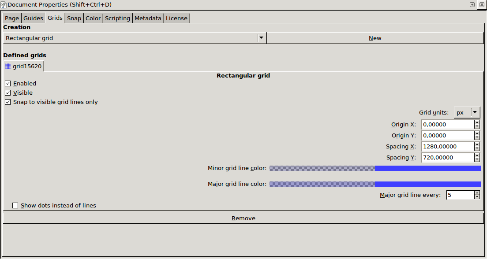

# Inkscape Slides

I quite like Inkscape, and I do a lot of conference talks and educational
videos, and so sometimes I use Inkscape for making slides.

This repo contains two things that have made this easier for me.

* Some HTML+JS that loads an SVG in your browser and turns it into a slide deck
* A Ruby script to batch export slides to PNG

Another great use case it creating wireframes, exporting them and importing them
in your favorite prototyping tool.

## Preparing your SVG

To create an SVG in Inkscape that you can use with these scripts, first choose
your slide size (say 1280x720, or 1024x768), and set that as your document size.
Make sure to set the "Unit" to "px" first.


Then set up a grid with the same dimensions



Now lay out your slides in columns and rows, keeping the actual document border as the top left slide.


By the way, it pays off to get comfortable with the Transform tool


## Using the HTML/JS Script

Put `svg-slides.html` and `svg-slides.js` in the same directory as your SVG
file, and change the reference in the HTML file to point at your SVG instead of
`argentina.svg`.

Opening the HTML in your browsers straight from the filesystem won't work
because it loads the SVG over AJAX. Instead you can launch a quick web server
like

```
ruby -run -e httpd . -p 4567
```

or


```
busybox httpd -f -p 4567
```

(If you don't have Ruby or Busybox install try any of these
[million other oneliners](https://gist.github.com/willurd/5720255))

Now open
[http://localhost:4567/svg-slides.html#0](http://localhost:4567/svg-slides.html)
in your browser and use the left/right arrow keys to navigate.

Here's what [the result looks like](http://arnebrasseur.net/talks/rubyconfar2013/).

## Using the Ruby Script

The Ruby script will generate shell code, so you need to pipe the output to `sh`, for example

```
./inkscape-slides.rb argentina.svg --rows 1 --columns 43 --geometry 1024x768 | sh
```

This will create 43 numbered PNG files.

## Hacks

Both of these scripts are "hacks that work for me", you are welcome to adopt
them as "hacks that for you", but expect to get your hands dirty.

Pull requests are very welcome.

## Trivia

A wonderful thing that I learned while hacking these scripts together, the SVG
coordinate system is supposed to start in the top left corner pointing down, but
the Inkscape coordinate system starts at the bottom left corner pointing up.
This is because Inkscape (formerly Sodipodi) predates the spec. There are a
couple old bug tracker tickets to resolve this, but nothing has really moved the
last couple of years.

The fun starts when you start using inkscape from the command line to do batch
exporting, because there, and only there, it uses the standard coordinate
system. Mucho head scratching ensues.

## License

&copy; Arne Brasseur

Mozilla Public License 2.0 (MPL-2.0)

https://tldrlegal.com/license/mozilla-public-license-2.0-(mpl-2)
